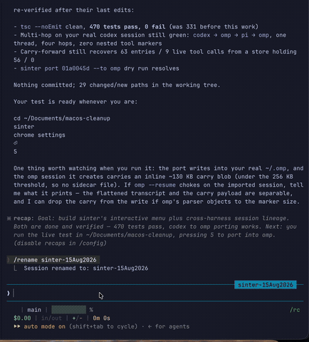

# sinter

Sinter indexes local coding-agent sessions, renders a portable session format, and ports supported sessions between harnesses.

## Demo



## Install

Sinter requires [Bun](https://bun.sh); its SQLite support is part of the runtime.

```sh
# Run once
bunx @jensenloke/sinter --help

# Install globally
bun add --global @jensenloke/sinter
# or: npm install --global @jensenloke/sinter

sinter --help
```

Interactive runs check npm at most once per day and offer to install a newer release. Use `--no-update-check` or set `SINTER_NO_UPDATE_CHECK=1` to disable this; scripts, CI, and non-interactive output never prompt.

See the [v0.1.10 release notes](docs/releases/v0.1.10.md) for the latest changes.

## Quick start

```sh
sinter scan
sinter scan --json
sinter ls --since 7d
sinter recent --cwd .
sinter pin <id-prefix>          # keep an important session in a local shortlist
sinter pinned                  # list bookmarks across harnesses
sinter thread <id-prefix>      # inspect port lineage and the resumable tip
sinter projects                 # group resumable sessions by working directory
sinter last --cwd .             # print the newest native resume command
sinter last --cwd . --exec      # resume it in this terminal
sinter search "session alias or topic"
sinter rename <id-prefix> "My important session"
sinter show <id-prefix>
sinter show <id-prefix> --ndjson       # one versioned JSON record per line
sinter compare <source-id> <target-id>  # structural transfer check; no content printed
sinter show <id-prefix> --tail 20       # render only the latest entries
sinter port <id-prefix> --to codex --mode compact --preview
sinter port <id-prefix> --to omp
sinter resume <id-prefix> --in omp --exec
sinter feedback
sinter gui
```

Commands with `--json` or `--ndjson` keep stdout machine-readable and return
errors on stderr using the versioned `sinter.error.v1` envelope. Transcript
streams use `sinter.transcript.ndjson.v1`: session metadata first, then ordered
entries, followed by linked nested sessions. Structural comparisons use
`sinter.compare.v1` and never include transcript content.

Inspect profile configuration without starting a scan:

```sh
sinter config path
sinter config show
sinter config validate
```

## Feedback

Run `sinter feedback` to open a prefilled GitHub issue. Sinter includes only its
version, the Bun version, OS/architecture, and the names of detected harnesses.
It never includes paths, session IDs, prompts, or transcript content. Use
`sinter feedback --no-open` to print the URL instead.

## Local GUI

`sinter gui` opens a local session workspace with harness filters, search,
thread lineage, transcript preview, resume, and port actions. The server binds
only to `127.0.0.1`; a random URL token protects its data and action endpoints.
The browser reads the same local ledger and adapters as the CLI, so transcripts
do not leave the machine. Use `sinter gui --no-open` to print the URL without
launching a browser.

## Anonymous usage measurement

Telemetry is disabled by default. Users can explicitly enable the small,
documented event stream with:

```sh
sinter telemetry enable --endpoint https://your-collector.example/events
sinter telemetry status
sinter telemetry disable
```

Events contain only a random installation ID, Sinter version, OS/architecture,
event name (`first_run`, `scan`, `port_success`, `resume`, or `gui_open`), and
timestamp. CI and non-interactive invocations never emit events. Set
`SINTER_TELEMETRY=0` for an additional environment-level kill switch. The
collector endpoint is intentionally operator-configured until Sinter has a
published first-party privacy policy and endpoint.

## Shell completions

Generate native completions for commands, flags, harness names, and transfer
modes. Sinter prints the script and never edits shell configuration itself.

```sh
# zsh — current shell
source <(sinter completion zsh)

# bash — current shell
source <(sinter completion bash)

# fish — current shell
sinter completion fish | source
```

To make completions permanent, write the generated script into the completion
directory managed by your shell or dotfiles.

## Privacy and safety

- Sinter reads local session stores only; it does not upload transcripts.
- Anonymous product telemetry is off by default and never contains session data.
- Source stores are read-only. A port creates a new target-native session.
- Historical tool calls are rendered inert by default. Use `--live-tools` only when that behavior is explicitly required.
- `sinter privacy` describes local data handling and `sinter doctor` reports detected stores.
- `sinter doctor --report -o sinter-diagnostics.md` creates a reviewable support report without paths, prompts, titles, session IDs, transcripts, or raw adapter errors.

## Harness support

| Harness | Read | Port target | Native resume |
|---|---:|---:|---:|
| Claude Code | yes | yes | yes |
| Codex CLI | yes | yes | yes |
| Devin CLI | yes | yes | yes |
| opencode | yes | yes | yes |
| ZCode | yes | experimental | unverified |
| Oh My Pi | yes | yes | yes |
| pi | yes | yes | yes |

## Roadmap

See [ROADMAP.md](ROADMAP.md) for planned CLI improvements, encrypted
cross-device session transfer, Sinter Cloud, team handoffs, and the longer-term
cloud-execution research path.

## Development

```sh
bun test
bunx tsc --noEmit
```

Fixtures are wholly synthetic. They retain only vendor-format structure and test edge cases; they contain no user sessions or account data.

## License

Apache-2.0
